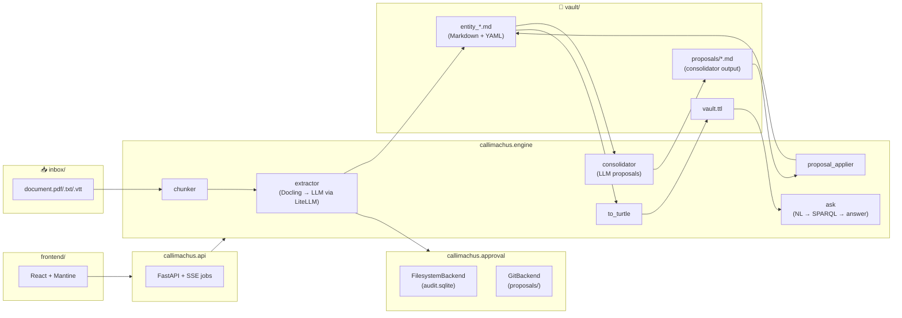

# Callimachus

> *Callimachus of Cyrene wrote the* Pinakes *— the first catalog of the Library
> of Alexandria. He didn't write the books; he made them findable.*

A configurable platform for turning documents into typed, queryable knowledge
graphs. You bring a corpus and a *pack* (a declarative schema + prompts +
queries); Callimachus extracts entities with an LLM, stages them as
Markdown+YAML in a *vault*, lets a human approve or reject each batch, and
gives you SPARQL and natural-language access to the result.

**It is good at:**

- **Legal & compliance ontologies** — statute → provisions → definitions →
  obligations, with regulator and jurisdiction relationships.
- **Qualitative / thematic analysis** — interview transcripts → codes →
  subthemes → themes, with verbatim provenance back to speaker turns.
- **Literature reviews** — papers → claims → entities → relations, with
  citation-grade provenance to page numbers.

**Differentiating idea:** every proposed mutation of the graph — a new
extraction, a merge, a re-label, a hierarchy edit — arrives as a reviewable
artifact (a pull-request branch *or* a pending submission in an audit DB) that
a human can inspect, debate, and approve. Nothing lands in the canonical
vault unattended.

---

## Quickstart (≤ 5 minutes)

**1. Clone + install**

```bash
git clone https://github.com/elroy-galbraith/callimachus.git
cd callimachus
python -m venv .venv
```

Activate the venv — pick your platform:

```powershell
# Windows (PowerShell)
.venv\Scripts\activate
```

```bash
# macOS / Linux (bash, zsh)
source .venv/bin/activate
```

Then install. Quote the extras so zsh doesn't try to glob `[api]`:

```bash
pip install -e ".[api]"
```

**2. Run the backend + frontend**

Easiest path — one command, both services, from the repo root:

```bash
cd frontend
npm install        # first time only
npm run dev:all    # starts uvicorn (:8000) and vite (:5173) together
```

Or run them manually in two terminals if you prefer:

```bash
# terminal 1 — backend
uvicorn callimachus.api.main:app --reload --port 8000

# terminal 2 — frontend
cd frontend
npm install
npm run dev
```

Open <http://localhost:5173>. Pick a shipped project (`compliance` or
`thematic`), drop a document into the inbox, click **Process**, and review
the proposed entities.

Before you process anything, set at least one provider API key in `.env`
at the repo root, e.g.:

```dotenv
ANTHROPIC_API_KEY=sk-ant-…
# or any of:
OPENAI_API_KEY=…
GEMINI_API_KEY=…
MISTRAL_API_KEY=…
COHERE_API_KEY=…
TOGETHER_API_KEY=…
```

The **Settings** page shows which provider keys the API process can see,
and the **Schema** page has a per-project model picker so different
projects can target different vendors. See *LLM provider support* below
for details.

For a CLI-only run (no web UI):

```bash
pip install -e ".[curator]"
python scripts/curator.py --once          # extract every PDF in inbox/
python scripts/to_turtle.py               # vault → Turtle
python scripts/ask.py "What's in the graph?" --show-sparql
```

---

## Shipped projects

| Project | Pack | Use case | Approval |
|---|---|---|---|
| `compliance` | `builtin/compliance` | Caribbean data-protection law (Jamaica DPA 2020 as the worked example) | git (PR-as-mutation) |
| `thematic` | `builtin/thematic` | Synthetic interview transcripts → codes, subthemes, themes | filesystem (SQLite audit) |
| `densho_themes` | `pack/` (project-local) | Densho Digital Archive Japanese-American incarceration oral histories — real-world thematic analysis | filesystem |

Add a new project by either:

1. **Reusing a built-in pack** — `python -m callimachus.project create <name> --template compliance`, or
2. **Writing your own pack** — copy `callimachus/pack/builtin/thematic/` as a starting point, edit `pack.yaml`'s classes/properties/prompts/CQs, point a project at it.

A pack is just a YAML file plus optional SPARQL `.rq` files and a Python
`hooks.py`. Schema changes don't require code changes.

---

## Architecture



The engine is sync Python. The API wraps it in async routes that run slow
work (extract, ask, consolidate, apply) as background jobs and stream
progress to the React frontend via Server-Sent Events.

---

## Repository layout

```
callimachus/
├── callimachus/              # Python package
│   ├── api/                  # FastAPI service (8 routers, 18 routes)
│   ├── engine/               # Sync engine: extractor, curator, ask, consolidator…
│   ├── project/              # Project = pack + paths + approval backend
│   ├── pack/                 # DomainPack model + loader + builtins
│   └── approval/             # FilesystemBackend + GitBackend
├── frontend/                 # React + Vite + Mantine + TanStack Query
├── projects/                 # Active projects (compliance, thematic, densho_themes…)
├── scripts/                  # CLI entry points (callimachus-extract, -ask, etc.)
├── legacy-streamlit/         # Original Streamlit UI; archived, still runnable
├── tests/api/                # FastAPI smoke tests (31 tests)
├── docs/                     # Demo script, outreach materials, related work
└── pyproject.toml
```

---

## LLM provider support

Callimachus calls LLMs through [LiteLLM](https://github.com/BerriAI/litellm),
so any provider that exposes tool / function calling works — Anthropic
Claude, OpenAI GPT, Google Gemini, Mistral, Cohere, Together-hosted
Llama, AWS Bedrock, Azure OpenAI, and more. Model ids follow
LiteLLM's `<provider>/<model>` convention:

```yaml
# in pack.yaml
models:
  extractor: anthropic/claude-haiku-4-5-20251001
  ask:       openai/gpt-4o
# or gemini/gemini-2.5-pro, mistral/mistral-large-latest, …
```

Per-project model selection is editable in the UI: open **Schema →
Models** and pick from a curated dropdown (or paste any LiteLLM id).
Edits write back to the project's `pack.yaml`. Built-in packs
(`builtin/compliance`, `builtin/thematic`) are read-only — recreate the
project from the template to materialise an editable copy.

The Settings page shows which provider keys the API process has
visibility on. Add as many as you need to `.env`; LiteLLM picks the right
one based on the model id's provider prefix.

> **Note on the LiteLLM dependency:** the package is pinned to an exact
> version in `pyproject.toml` (no `>=` range). This is deliberate
> hardening against the March 2026 PyPI supply-chain incident that
> shipped malicious `litellm` 1.82.7/1.82.8 releases. Bump deliberately
> after reviewing upstream release notes.

---

## Demo

```bash
# Process the shipped Jamaica DPA 2020 PDF through the compliance pack
python scripts/curator.py --once
git log --oneline proposals/dpa_2020_s6        # PR-as-mutation lands here
python scripts/ask.py "What obligations apply to a data controller?"
```

See [docs/demo_script.md](docs/demo_script.md) for the two-minute screen-
recording flow.

---

## Origin

Callimachus started as `carib-comp-ont` — a single-statute prototype for
extracting the Jamaica Data Protection Act 2020 into a queryable RDF graph,
complementary to Donalds, Barclay & Osei-Bryson (2023) *Towards a Cybercrime
Classification Ontology for Developing Countries*. As the prototype grew to
handle qualitative-research transcripts and literature reviews, the
compliance work became one project among several, and the platform earned its
own name.

The original Caribbean compliance work ships as the `compliance` project; see
`projects/compliance/` for the schema, vault, and competency questions.

---

## License

MIT © 2026 Elroy Galbraith
